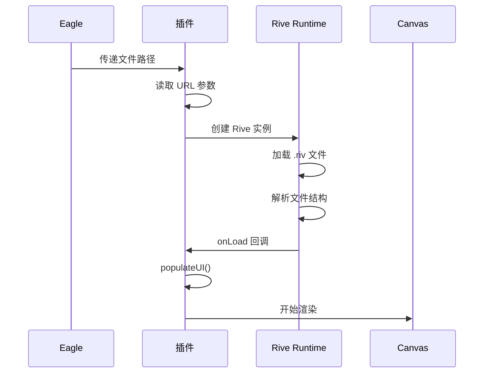
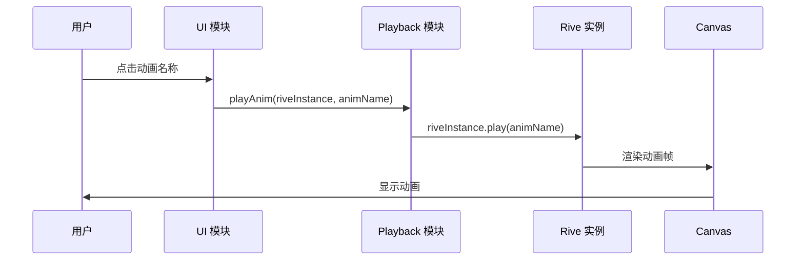
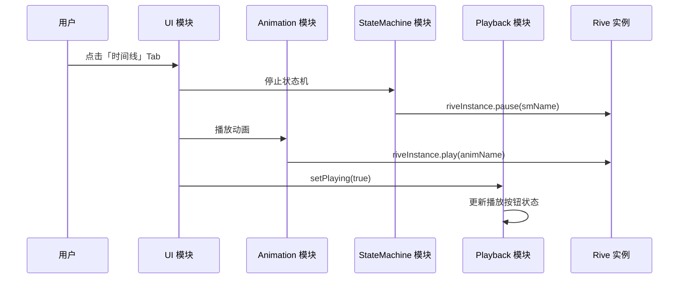
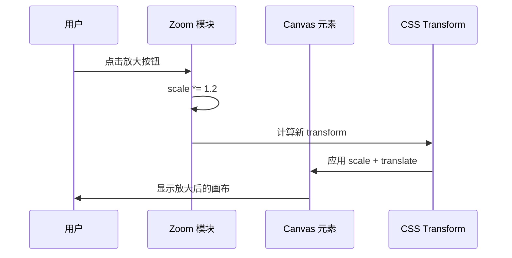
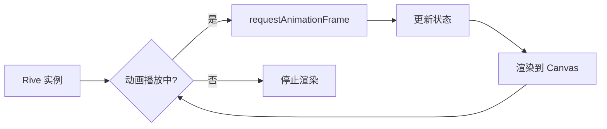

# 架构设计文档

本文档详细说明 Eagle Rive 插件的架构设计、模块划分和技术实现。

## 📋 目录

- [整体架构](#整体架构)
- [模块划分](#模块划分)
- [数据流向](#数据流向)
- [Eagle 插件机制](#eagle-插件机制)
- [Rive 运行时集成](#rive-运行时集成)
- [通信机制](#通信机制)
- [渲染流程](#渲染流程)

## 🏗️ 整体架构

### 架构图

```mermaid
graph TB
    subgraph "Eagle Application"
        Eagle[Eagle 主应用]
    end

    subgraph "Plugin Layer"
        Manifest[manifest.json]
        Thumbnail[thumbnail/riv.js]
        Viewer[viewer/riv.html]
    end

    subgraph "Previewer Modules"
        App[app.js<br/>应用入口]
        Animation[animation.js<br/>动画模块]
        StateMachine[state-machine.js<br/>状态机模块]
        Playback[playback.js<br/>播放控制]
        Zoom[zoom.js<br/>缩放控制]
        UI[ui.js<br/>UI 交互]
        DataBinding[data-binding.js<br/>数据绑定]
        Shortcuts[shortcuts.js<br/>快捷键面板]
        Performance[performance.js<br/>FPS 监控]
    end

    subgraph "External Libraries"
        RiveRuntime[@rive-app/webgl2<br/>Rive 运行时]
        Sharp[sharp<br/>图片处理]
    end

    Eagle -->|加载插件| Manifest
    Eagle -->|生成缩略图| Thumbnail
    Eagle -->|打开预览| Viewer

    Viewer --> App
    App --> Animation
    App --> StateMachine
    App --> Playback
    App --> Zoom
    App --> UI
    App --> DataBinding
    App --> Shortcuts
    App --> Performance

    Animation --> RiveRuntime
    StateMachine --> RiveRuntime
    Playback --> RiveRuntime

    Thumbnail --> Sharp
    Thumbnail --> RiveRuntime
```

### 架构特点

1. **模块化设计** - IIFE 模式封装，避免全局污染
2. **事件驱动** - 模块间通过事件和回调通信
3. **分层架构** - Eagle 插件层 → 预览器层 → 模块层
4. **松耦合** - 模块通过 `window` 对象暴露 API

## 📦 模块划分

### 1. 应用入口（app.js）

**职责**：
- 初始化 Rive 实例
- 加载和初始化所有模块
- 处理 Eagle 传递的参数（文件路径、主题）
- 协调模块间的通信

**核心函数**：
```javascript
// 初始化 Rive 实例
function initRive()

// 填充 UI 元素
function populateUI()

// 画布尺寸适配
function fitCanvas()
```

**全局状态**：
```javascript
window.riveInstance = null;          // Rive 实例
window.currentFilePath = filePath;   // 当前文件路径
```

### 2. 动画模块（animation.js）

**职责**：
- 管理动画列表
- 切换和播放动画
- 监听动画状态

**公共 API**：
```javascript
window.Animation = {
    // 获取当前动画
    getCurrentAnim(),

    // 设置并播放动画
    playAnim(riveInstance, animName),

    // 停止动画
    stopAnim(riveInstance),

    // 填充动画列表
    populateAnims(riveInstance)
};
```

### 3. 状态机模块（state-machine.js）

**职责**：
- 管理状态机列表
- 处理 Inputs（Trigger, Boolean, Number）
- 状态机切换和交互

**公共 API**：
```javascript
window.StateMachine = {
    // 获取当前状态机
    getCurrentSM(),

    // 停止状态机
    stopSM(riveInstance, smName),

    // 填充状态机列表
    populateSMs(riveInstance),

    // 设置 Inputs
    setInputs(riveInstance, smName)
};
```

### 4. 播放控制模块（playback.js）

**职责**：
- 播放/暂停控制
- 重新播放
- 速度控制（0.1x - 3.0x）
- 方向控制（已实现，未激活）

**公共 API**：
```javascript
window.Playback = {
    // 绑定播放控制事件
    bindEvents(riveInstance),

    // 设置播放状态
    setPlaying(isPlaying),

    // 设置播放速度
    setSpeed(speed),

    // 设置播放方向
    setDirection(direction),

    // 获取播放状态
    getPlaying(),

    // 获取播放速度
    getSpeed(),

    // 重新播放
    restart(riveInstance)
};
```

**状态管理**：
```javascript
// 私有状态
let isPlaying = false;
let currentSpeed = 1.0;
let currentDirection = 1; // 1: 正向, -1: 反向
```

### 5. 缩放控制模块（zoom.js）

**职责**：
- 画布缩放（放大、缩小、重置）
- 画布平移
- 鼠标滚轮缩放
- 空格 + 拖动平移

**公共 API**：
```javascript
window.Zoom = {
    // 绑定缩放事件
    bindEvents(),

    // 放大
    zoomIn(),

    // 缩小
    zoomOut(),

    // 重置缩放
    resetZoom(),

    // 获取当前缩放比例
    getScale(),

    // 获取当前偏移量
    getOffset()
};
```

**实现原理**：
```javascript
// 使用 CSS Transform
transform = `scale(${scale}) translate(${translateX}px, ${translateY}px)`
```

### 6. UI 交互模块（ui.js）

**职责**：
- Tab 切换（时间线 / 状态机）
- 背景切换（白色 / 黑色 / 透明棋盘格）
- 画板选择器
- UI 状态管理

**公共 API**：
```javascript
window.UI = {
    // 绑定 UI 事件
    bindEvents(),

    // 切换 Tab
    switchTab(tabName),

    // 切换背景
    switchBackground(type),

    // 显示/隐藏元素
    showElement(selector),
    hideElement(selector),

    // 显示错误
    showError(message),

    // 显示 .rev 提示
    showRevNotice()
};
```

**Tab 切换逻辑**：
```javascript
function switchTab(tabName) {
    if (tabName === 'timeline') {
        // 暂停状态机
        if (curSM) riveInstance.pause(curSM);
        // 播放动画
        if (curAnim) animationModule.playAnim(riveInstance, curAnim);
    } else if (tabName === 'state-machine') {
        // 暂停动画
        if (curAnim) riveInstance.pause(curAnim);
        // 激活状态机交互
    }
}
```

### 7. 数据绑定模块（data-binding.js）

**职责**：
- ViewModel 管理
- 属性编辑（String, Number, Boolean, Color, Enum, Trigger）
- 嵌套 ViewModel 支持（最多 3 层）
- 实时反映到画布

**公共 API**：
```javascript
window.DataBinding = {
    // 填充 ViewModel 列表
    populateViewModels(riveInstance),

    // 选择 ViewModel
    selectViewModel(riveInstance, vmName),

    // 设置属性值
    setProperty(riveInstance, vmInstance, propertyPath, value),

    // 递归显示嵌套属性
    displayNestedProperties(viewModel, container, depth = 0)
};
```

**类型标准化**：
```javascript
// 兼容 WASM 数字枚举和字符串枚举
function normalizeType(type) {
    const typeMap = {
        '0': 'string',
        '1': 'number',
        '2': 'boolean',
        '3': 'color',
        '4': 'enum',
        '5': 'trigger',
        'string': 'string',
        'number': 'number',
        // ...
    };
    return typeMap[type] || type;
}
```

### 8. 快捷键面板模块（shortcuts.js）

**职责**：
- 显示快捷键列表
- ? 按钮事件处理
- 面板显示/隐藏

**公共 API**：
```javascript
window.Shortcuts = {
    // 初始化快捷键面板
    init(),

    // 显示面板
    show(),

    // 隐藏面板
    hide()
};
```

**快捷键列表**：
```javascript
const SHORTCUTS = [
    { key: 'Ctrl+0', desc: '重置缩放' },
    { key: 'Ctrl++', desc: '放大' },
    { key: 'Ctrl+-', desc: '缩小' },
    { key: '按住 Space + 拖动', desc: '平移画布' },
    { key: 'Ctrl + 滚轮', desc: '缩放' }
];
```

### 9. 性能监控模块（performance.js）

**职责**：
- FPS 计算
- 实时显示
- 彩色指示（绿/橙/红）

**公共 API**：
```javascript
window.Performance = {
    // 初始化 FPS 监控
    init(),

    // 启动监控
    start(),

    // 停止监控
    stop(),

    // 获取当前 FPS
    getFPS()
};
```

**FPS 计算原理**：
```javascript
let frameCount = 0;
let lastTime = performance.now();
const updateInterval = 500; // 每 500ms 更新一次

function updateFPS() {
    frameCount++;
    const currentTime = performance.now();
    const elapsed = currentTime - lastTime;

    if (elapsed >= updateInterval) {
        fps = Math.round((frameCount * 1000) / elapsed);
        frameCount = 0;
        lastTime = currentTime;
        updateDisplay();
    }

    requestAnimationFrame(updateFPS);
}
```

## 📊 数据流向

### 1. 文件加载流程



### 2. 动画播放流程



### 3. Tab 切换流程



### 4. 缩放控制流程



## 🔌 Eagle 插件机制

### manifest.json

```json
{
    "id": "041323c2-e4b8-433e-a079-160d73deea24",
    "version": "2.0.0",
    "name": "Rive",
    "preview": {
        "riv,rev": {
            "thumbnail": {
                "path": "thumbnail/riv.js",
                "size": 400
            },
            "viewer": {
                "path": "viewer/riv.html"
            }
        }
    }
}
```

**关键字段**：
- `id` - 插件唯一标识符
- `preview` - 预览配置
  - `thumbnail` - 缩略图生成脚本
  - `viewer` - 预览器 HTML 文件

### 缩略图生成

**thumbnail/riv.js** 流程：

1. Eagle 调用脚本，传递文件路径
2. 创建离屏 Canvas
3. 初始化 Rive WebGL2 渲染器
4. 加载 .riv 文件
5. 等待 10 帧渲染完成
6. `toBlob()` 截图
7. 返回 PNG 数据给 Eagle

```javascript
// 核心代码
riveInstance = new rive.Rive({
    src: filePath,
    canvas: canvas,
    autoplay: true,
    onLoad: () => {
        // 等待 10 帧确保渲染完成
        let frames = 0;
        function waitForFrames() {
            frames++;
            if (frames >= 10) {
                canvas.toBlob((blob) => {
                    // 返回给 Eagle
                });
            } else {
                requestAnimationFrame(waitForFrames);
            }
        }
        waitForFrames();
    }
});
```

### 预览器通信

**URL 参数传递**：
```
viewer/riv.html?path=/path/to/file.riv&theme=dark
```

**参数解析**（app.js）：
```javascript
const params = new URLSearchParams(location.search);
const filePath = params.get('path');
const theme = params.get('theme') || 'light';
```

## 🎨 Rive 运行时集成

### 运行时版本

```json
{
  "resolutions": {
    "@rive-app/webgl2": "2.35.0"
  }
}
```

### 加载方式

**CDN 加载**（riv.html）：
```html
<script src="https://unpkg.com/@rive-app/webgl2@2.35.0"></script>
```

### WebGL2 渲染器

**优势**：
- 完整支持羽化（Feather）
- 完整支持模糊（Blur）
- 完整支持混合模式（Blend Modes）
- GPU 加速，性能更好

**初始化**：
```javascript
const riveInstance = new rive.Rive({
    src: filePath,
    canvas: canvas,
    // 使用 WebGL2 渲染器
    renderer: 'webgl2', // 或默认（自动选择）
    autoplay: false,
    autoBind: true,
    layout: new rive.Layout({
        fit: rive.Fit.Contain,
        alignment: rive.Alignment.Center
    })
});
```

### TimeScale API

**速度控制实现**：
```javascript
function setSpeed(speed) {
    currentSpeed = speed;
    if (window.riveInstance) {
        window.riveInstance.timeScale = speed;
    }
}
```

**重新播放时保持速度**：
```javascript
function restart(riveInstance) {
    riveInstance.reset();  // 清除 timeScale
    applyTimeScale();       // 重新应用
    riveInstance.play();
}
```

## 🔄 通信机制

### 模块间通信

**方法 1：全局对象**（主要方式）
```javascript
// 模块 A 暴露 API
window.ModuleA = {
    doSomething() { }
};

// 模块 B 调用
window.ModuleA.doSomething();
```

**方法 2：事件监听**
```javascript
// 监听 Rive 事件
riveInstance.on(rive.EventType.Play, () => {
    console.log('Animation started');
});
```

### 模块初始化顺序

1. **加载 HTML 和 CSS**
2. **加载 Rive 运行时**
3. **加载模块**（按 riv.html 中的顺序）：
   ```html
   <script src="js/utils.js"></script>
   <script src="js/animation.js"></script>
   <script src="js/state-machine.js"></script>
   <script src="js/data-binding.js"></script>
   <script src="js/zoom.js"></script>
   <script src="js/playback.js"></script>
   <script src="js/ui.js"></script>
   <script src="js/shortcuts.js"></script>
   <script src="js/performance.js"></script>
   <script src="js/app.js"></script>
   ```
4. **app.js 初始化所有模块**

## 🎬 渲染流程

### 渲染循环



### Canvas 尺寸适配

```javascript
function fitCanvas() {
    canvas.width = container.clientWidth;
    canvas.height = container.clientHeight;
    if (window.riveInstance) {
        window.riveInstance.resizeDrawingSurfaceToCanvas();
    }
}

// 监听窗口大小变化
window.addEventListener('resize', fitCanvas);
```

## 🔧 扩展开发

### 添加新模块

**步骤**：

1. **创建模块文件**（`viewer/js/my-module.js`）：
   ```javascript
   (function() {
       'use strict';

       // 私有变量
       const privateVar = 'secret';

       // 公共 API
       window.MyModule = {
           publicMethod() {
               console.log('Hello from MyModule');
           }
       };
   })();
   ```

2. **在 riv.html 中引入**：
   ```html
   <script src="js/my-module.js"></script>
   ```

3. **在 app.js 中初始化**（如需要）：
   ```javascript
   if (window.MyModule) {
       window.MyModule.init();
   }
   ```

4. **编写测试**（`tests/my-module.test.js`）：
   ```javascript
   describe('MyModule', () => {
       it('应该正确执行 publicMethod', () => {
           window.MyModule.publicMethod();
           // 断言
       });
   });
   ```

### 添加新功能

**示例：添加全屏功能**

1. **在 playback.js 中添加**：
   ```javascript
   function toggleFullscreen() {
       if (!document.fullscreenElement) {
           document.documentElement.requestFullscreen();
       } else {
           document.exitFullscreen();
       }
   }

   // 暴露到公共 API
   window.Playback.toggleFullscreen = toggleFullscreen;
   ```

2. **在 HTML 中添加按钮**：
   ```html
   <button id="fullscreenBtn" class="control-btn">
       <svg>...</svg>
   </button>
   ```

3. **绑定事件**：
   ```javascript
   document.getElementById('fullscreenBtn')
       .addEventListener('click', () => {
           window.Playback.toggleFullscreen();
       });
   ```

## 📚 相关文档

- [README.md](README.md) - 项目概览
- [CONTRIBUTING.md](CONTRIBUTING.md) - 贡献指南
- [TESTING.md](TESTING.md) - 测试文档
- [API.md](API.md) - API 参考

## 🔗 外部资源

- [Rive 官方文档](https://help.rive.app/)
- [Rive Web Runtime](https://github.com/rive-app/rive-web)
- [Eagle 插件开发](https://github.com/SilverFelix/Eagle-Plugin-Doc)

---

最后更新：2026-02-25
